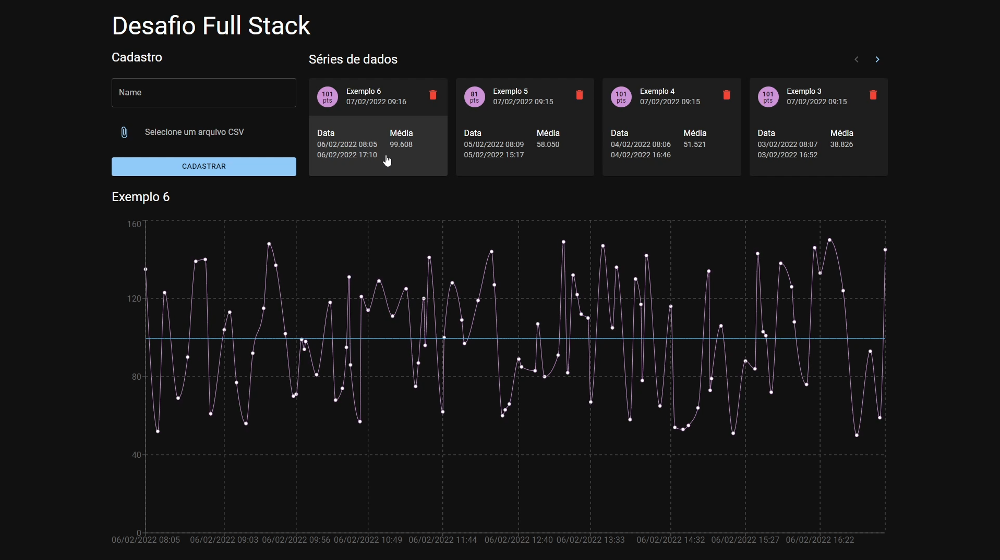
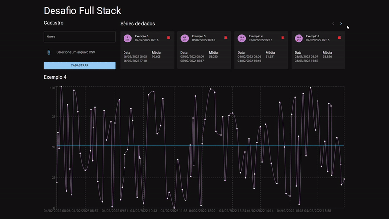
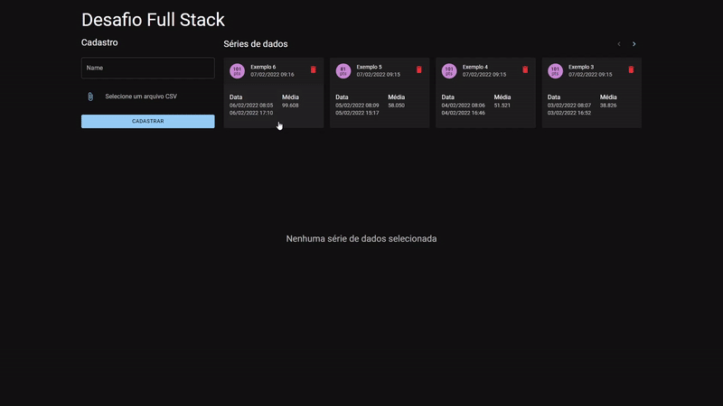
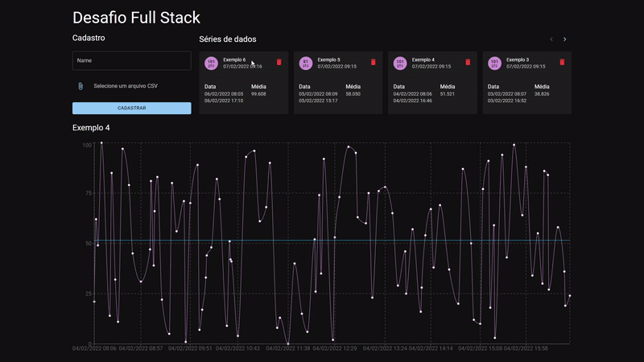
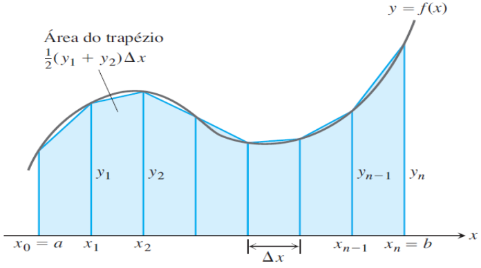

# Desafio para desenvolvedor(a) Full Stack

O objetivo deste desafio é avaliar a sua proficiência em desenvolvimento Full Stack Web conforme os
critérios abaixo:

- Domínio na leitura e entendimento de requisitos técnicos de uma aplicação
- Domínio no uso do **Git** como ferramenta de versionamento de código-fonte
- Experiência no desenvolvimento de **APIs RESTful**, no **backend**
- Experiência no desenvolvimento de **interfaces web**, no **frontend**
- Familiaridade com o uso de **SQL** e **bancos de dados relacionais** (RDBMS)
- Boa leitura e compreensão do **inglês técnico**; focado na leitura de documentação de bibliotecas
e frameworks, bem como na escrita de código-fonte, e.g. nomeação de funções e variáveis

## Desafio

Neste desafio, você desenvolverá uma aplicação web para gerenciar, visualizar e extrair métricas
simples de **séries de dados temporais**.

Em sua aplicação, o usuário deve ser capaz de:

- Cadastrar novas séries de dados temporais, a partir de um arquivo CSV
- Listar todas as séries de dados
- Visualizar uma série de dados em forma de gráfico de linha, juntamente com o seu valor médio
- Remover uma série de dados

Para exemplificar, veja o layout de exemplo da aplicação:



Reforçando que o layout acima deve ser entendido apenas como um exemplo, e você não preciso segui-lo
à risca. Além disso, para manter as coisas simples, não se preocupe com fatores como acessibilidade
e responsividade durante este desafio.

### Cadastro de série de dados

> **POST /data-series**

Para cadastrar uma série de dados, o usuário deve fornecer os seguintes dados de entrada:

- Nome da série de dados
- Arquivo [CSV](https://en.wikipedia.org/wiki/Comma-separated_values) com o conteúdo da série
  temporal: cada linha deverá ser composta por uma data no formato [ISO8601](https://en.wikipedia.org/wiki/ISO_8601)
  e um valor numérico, nesta ordem:

  ```csv
  2022-02-05T23:54:50Z,1
  2022-02-05T23:55:50Z,2
  2022-02-05T23:56:50Z,3
  ```

  Dentro da pasta `.github`, você pode encontrar alguns arquivos CSV de exemplo para testar com a
  sua aplicação.

No momento do cadastro, pense em quais validações você deve realizar, para garantir que os dados da
aplicação sempre estejam em um estado consistente.


### Listagem das séries de dados

> **GET /data-series**

Ao listar todas as séries de dados, é esperado que as seguintes informações sejam exibidas:

- Nome da série de dados
- Quantidade de pontos da série de dados
- Valor médio da série de dados
- Data de início, do ponto da série com a menor data
- Data de fim, do ponto da série com a maior data
- Data de cadastro da série de dados

Como as séries de dados podem conter muitos pontos, não é necessário enviá-los por completo no
conteúdo da resposta, apenas as informações listadas acima.

Além disso, pense que sua aplicação poderá ter muitas séries de dados cadastradas; mais do que é
possível exibir dentro do layout especificado. Para isso, utilize um mecanismo de paginação dos
resultados.



### Visualização de uma série de dados

> **GET /data-series/:id**

Ao clicar sobre um dos cards de séries de dados, sua aplicação deverá exibi-la em um gráfico de
linha, juntamente com uma linha horizontal representativa de seu valor médio.



### Remoção de uma série de dados

> **DELETE /data-series/:id**

Sua interface deverá ter ao menos um botão para remoção da série de dados da aplicação.

Além disso, é comum que ações destrutivas sejam acompanhadas de um modal ou alerta de confirmação,
para que o usuário tenha a chance de revisar e confirmar a sua ação:



### Cálculo do valor médio de uma série de dados temporal

É possível calcular o valor médio de uma série temporal através da fórmula abaixo:


Na fórmula acima, assume-se que:

- `x` representa o valor do tempo, no eixo horizontal
- `y` representa o valor numérico do ponto, no eixo vertical
- Os pontos da série de dados devem estar ordenados em ordem cronológica

A lógica por trás desta fórmula está em considerar que a série de dados é composta por `N` trapézios
e o valor médio da série é a **soma das suas áreas, dividida pela duração total da série**.



## Regras

### Entrega

O código-fonte utilizado para solucionar o desafio deverá ser disponibilizado na íntegra, após o
prazo de **5 dias** da data de recebimento do link para este repositório.

Como gostaríamos de avaliar o uso do Git pelo(a) candidato(a), você deverá disponibilizar o(s)
repositório(s) de sua solução de uma das seguintes maneiras:

- Repositório(s) público(s) na sua plataforma de gerenciamento de repositórios de escolha: GitHub,
  BitBucket ou GitLab
- Envio de um arquivo *.zip* para gabrielkim13@gmail.com, com todos os repositório(s), preservando
  seus diretórios ocultos `.git`, para que tenhamos acesso aos seu histórico de commits

### Tecnologias utilizadas

Abaixo estão as tecnologias cujo uso será avaliado em sua resolução do desafio:

- **Versionamento de código-fonte:**
  - Utilize [Git](http://git-scm.com/)

- **Backend / API:**
  - Utilize [Node.js](https://nodejs.org/en/)

- **Frontend / UI:**
  - Utilize [React](https://reactjs.org/)

- **Banco de dados:**
  - Utilize um banco de dados **relacional**
    - Sinta-se à vontade para utilizar o banco de dados que preferir; isto não afetará a sua
      avaliação de forma alguma
    - Por exemplo, um simples [SQLite](https://www.sqlite.org/index.html) é suficiente. Caso opte
      por outro banco, pedimos que forneça as instruções sobre como rodar uma instância dele em
      nossas máquinas

## Contato

Envie suas dúvidas diretamente para gabrielkim13@gmail.com, ou abra uma issue neste repositório.
